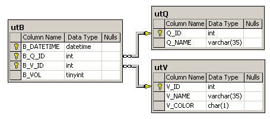

The database schema consists of 3 tables:

utQ (Q_ID int, Q_NAME varchar(35)), 

utV (V_ID int, V_NAME varchar(35), V_COLOR char(1)), 

utB (B_DATETIME datetime, B_Q_ID int, B_V_ID int, B_VOL tinyint).

The utQ table contains the identifiers and names of squares, the initial color of which is black. (Note: black is not a color and is considered unpainted. Only Red, Green and Blue are colors.)
The utV table contains the identifiers and names of spray cans and the color of paint they are filled with.
The utB table holds information on squares being spray-painted, and contains the time of the painting event, the square and spray can identifiers, the quantity of paint being applied.

It should be noted that

- a spray can may contain paint of one of three colors: red (V_COLOR='R'), green (V_COLOR='G'), or blue (V_COLOR='B');

- any spray can initially contains 255 units of paint;

- the square color is defined in accordance with the RGB model, i.e. R=0, G=0, B=0 is black, whereas R=255, G=255, B=255 is white;

- any record in the utB table decreases the paint quantity in the corresponding spray can by B_VOL and accordingly increases the amount of paint applied to the square by the same value;

- B_VOL must be greater than 0 and less or equal to 255;

- the paint quantity of a single color applied to one square can’t exceed 255, and there can’t be a less than zero amount of paint in a spray can;

- the time of the painting event (B_DATETIME) is specified with one second precision, i.e. it does not contain milliseconds;

- for historical reasons, the spray cans are referred to as “balloons” by many of the exercises, and the utV table contains spray can names (V_NAME column) such as “Balloon # 01”, etc.

