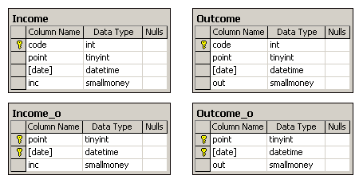

The firm owns several buy-back centers for collection of recyclable materials. Each of them receives funds to be paid to the recyclables suppliers. Data on funds received is recorded in the table

Income_o(point, date, inc)

The primary key is (point, date), where point holds the identifier of the buy-back center, and date corresponds to the calendar date the funds were received. The date column doesn’t include the time part, thus, money (inc) arrives no more than once a day for each center. Information on payments to the recyclables suppliers is held in the table

Outcome_o(point, date, out)

In this table, the primary key (point, date) ensures each buy-back center reports about payments (out) no more than once a day, too.
For the case income and expenditure may occur more than once a day, another database schema with tables having a primary key consisting of the single column code is used:

Income(code, point, date, inc)

Outcome(code, point, date, out)

Here, the date column doesn’t include the time part, either.

